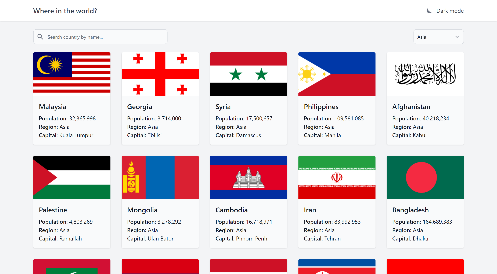

# Frontend Mentor - REST Countries API with color theme switcher solution

This is a solution to the [REST Countries API with color theme switcher challenge on Frontend Mentor](https://www.frontendmentor.io/challenges/rest-countries-api-with-color-theme-switcher-5cacc469fec04111f7b848ca). Frontend Mentor challenges help you improve your coding skills by building realistic projects. 

## Table of contents

- [Overview](#overview)
  - [The challenge](#the-challenge)
  - [Screenshot](#screenshot)
  - [Links](#links)
- [My process](#my-process)
  - [Built with](#built-with)
  - [What I learned](#what-i-learned)
  - [Continued development](#continued-development)
  - [Useful resources](#useful-resources)
- [Author](#author)
- [Acknowledgments](#acknowledgments)

**Note: Delete this note and update the table of contents based on what sections you keep.**

## Overview

### The challenge

Users should be able to:

- See all countries from the API on the homepage
- Search for a country using an `input` field
- Filter countries by region
- Click on a country to see more detailed information on a separate page
- Click through to the border countries on the detail page
- Toggle the color scheme between light and dark mode *(optional)*

### Screenshot

### Links

- Solution URL: [Github](https://github.com/prantiknoor/country-profile)
- Live Site URL: [Vercel](https://country-profile.vercel.app/)

## My process

### Built with

- Semantic HTML5 markup
- Flexbox
- CSS Grid
- Mobile-first workflow
- [SvelteKit](https://kit.svelte.dev/) - Svelte framework

### What I learned

Through working on this project, I have gained a strong understanding of both Svelte and SvelteKit.

### Continued development

I intend to continue developing my skills and knowledge in SvelteKit, constantly striving to expand my understanding and proficiency in this cutting-edge technology.

### Useful resources

- [Learn Svelte](https://learn.svelte.dev/) - Interactive way to learn Svelte & SvelteKit

## Author

- Frontend Mentor - [@prantiknoor](https://www.frontendmentor.io/profile/prantiknoor)
- Twitter - [@prantiknoor](https://www.twitter.com/prantiknoor)
- CodePen - [@prantiknoor](https://codepen.io/prantiknoor)

## Acknowledgments

Thanks to everyone who helped me learning code.